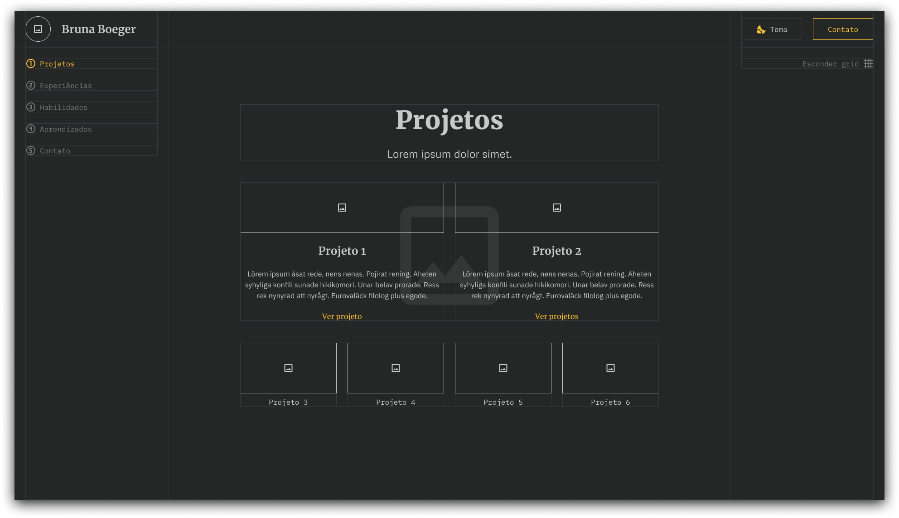
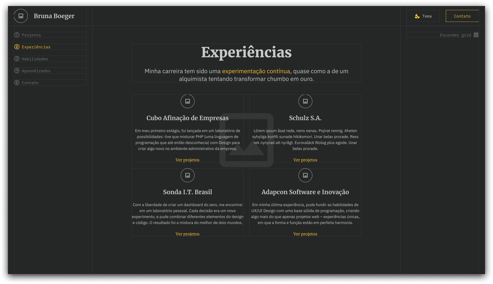
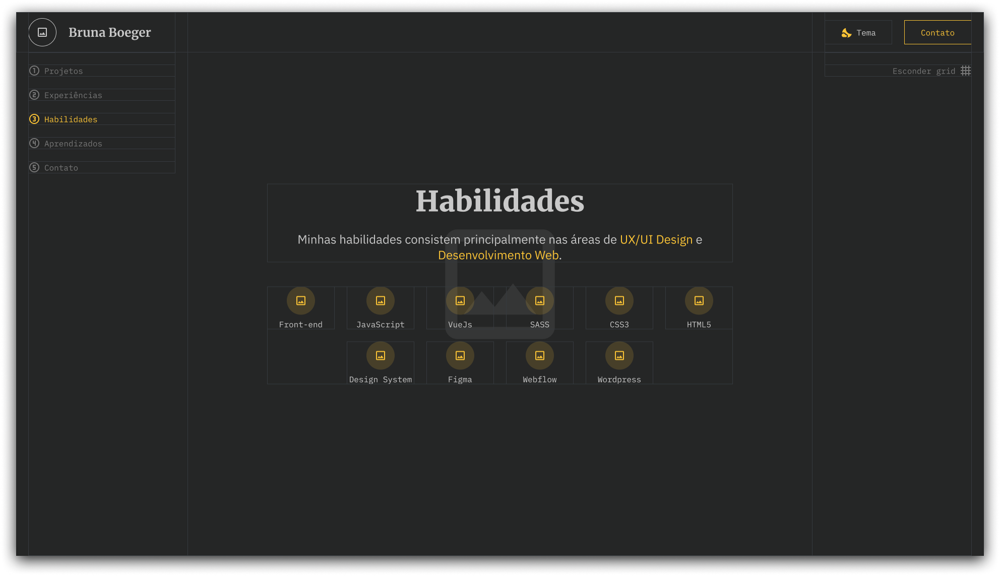
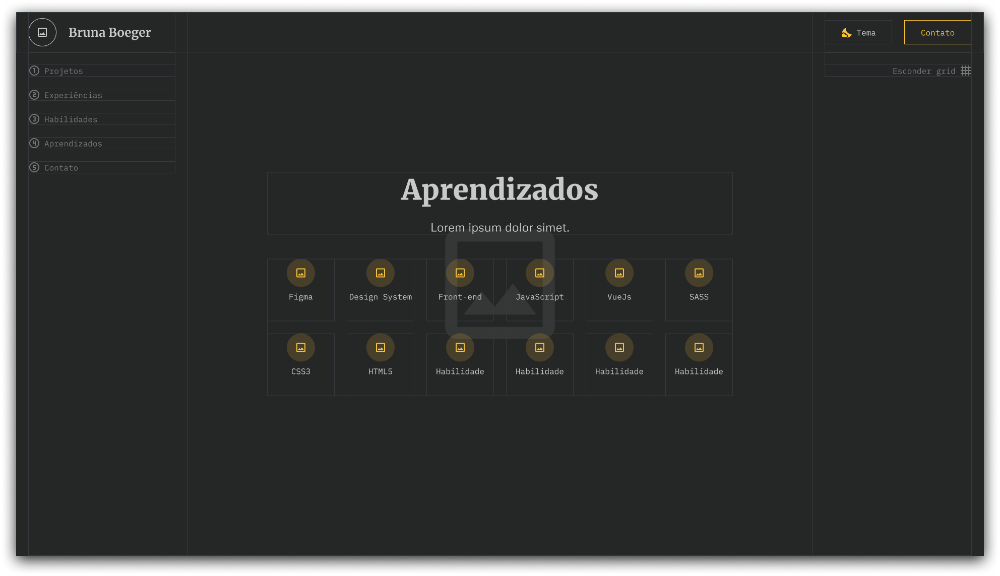
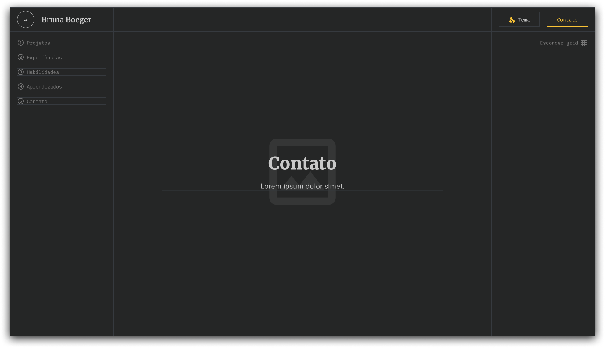
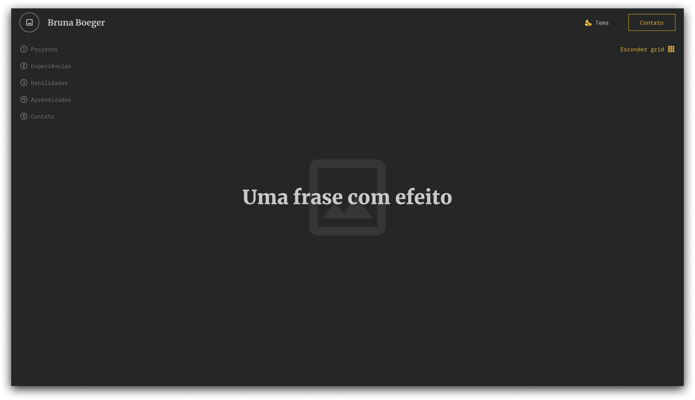

Esse é o meu primeiro site de portifólio.
🚩 Projeto ainda em construção.

## Tarefas a fazer

- [x] Wireframing inicial no Figma
- [x] Organização das pastas e arquivos
- [x] Instalação das dependências necessárias
- [ ] Desenvolvimento do layout inicial ⬅️ **Doing**
- [ ] Definição do style guide definitivo
- [ ] Adequar o layout final

## Design do site

Como primeiro passo para começar o projeto, foquei em criar o _wireframing_ do site, isto é, os rabiscos do que era realmente essencial ter. Ele ficou da seguinte maneira:

### Wireframing

## Tecnologias usadas

- React
- Next.js
- Vercel
